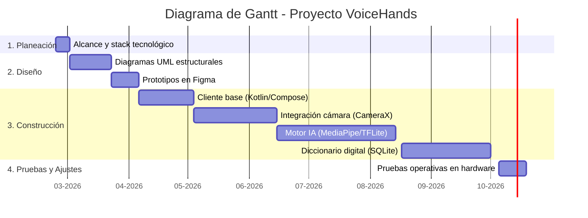

## Metodología y Cronograma

```mermaid
gantt
    title Diagrama de Gantt - Proyecto VoiceHands
    dateFormat  YYYY-MM-DD
    axisFormat  %m-%Y
    
    section 1. Planeación
    Alcance y stack tecnológico      :a1, 2026-02-23, 7d
    
    section 2. Diseño
    Diagramas UML estructurales      :a2, 2026-03-02, 21d
    Prototipos en Figma              :a3, 2026-03-23, 14d
    
    section 3. Construcción
    Cliente base (Kotlin/Compose)    :a4, 2026-04-06, 28d
    Integración cámara (CameraX)     :a5, 2026-05-04, 42d
    Motor IA (MediaPipe/TFLite)      :a6, 2026-06-15, 60d
    Diccionario digital (SQLite)     :a7, 2026-08-17, 45d
    
    section 4. Pruebas y Ajustes
    Pruebas operativas en hardware   :a8, 2026-10-05, 14d
```
