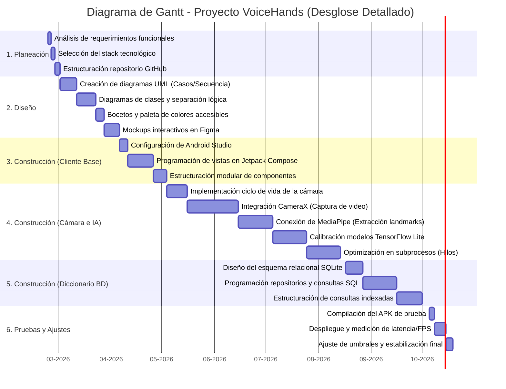

# VoiceHands

VoiceHands es un prototipo funcional de aplicación móvil nativa para la plataforma Android, diseñado para mitigar las profundas barreras de comunicación de la población sorda en el municipio de Mosquera, Cundinamarca[cite: 4, 10]. El sistema permite realizar una traducción bidireccional en tiempo real entre la Lengua de Señas Colombiana (LSC) y texto/voz.

## Características Principales

*   **Traducción en Tiempo Real:** El sistema transforma automatizadamente los gestos del abecedario dactilológico (A-Z), números y palabras clave de la LSC en texto o voz para el oyente.
*   **Traducción Inversa (Voz/Texto a Señas):** Permite convertir el texto o dictado por voz del oyente en representaciones visuales o animaciones dinámicas de señas para la persona sorda.
*   **Captura y Visión Artificial:** Captura secuencias de video ininterrumpidas con la API CameraX y extrae las coordenadas espaciales (21 *landmarks*) de las manos mediante MediaPipe Hands.
*   **Inferencia *On-Device*:** Utiliza modelos de inteligencia artificial optimizados en TensorFlow Lite (.tflite) que se ejecutan directamente en el dispositivo.
*   **Privacidad y Funcionamiento *Offline*:** Bajo una arquitectura de *Edge Computing*, toda la captura de video, los algoritmos de IA y la consulta del diccionario operan de forma local sin requerir conexión a internet, garantizando la privacidad de los usuarios.
*   **Diccionario Digital Integrado:** Base de datos relacional local embebida, estructurada con SQLite y administrada a través de Room Database.

## Stack Tecnológico y Arquitectura

*   **Lenguaje de Programación:** Kotlin 2.0.
*   **Frontend (UI):** Interfaz declarativa, reactiva y accesible construida con Jetpack Compose.
*   **Patrón Arquitectónico:** MVVM (Model-View-ViewModel) con principios de Clean Architecture y estructuración modular.
*   **Visión Artificial e IA:** MediaPipe (rastreo esquelético) y TensorFlow Lite (clasificación gestual).
*   **Persistencia de Datos:** SQLite y Room Database.

##  Requisitos e Instalación

*   **Sistema Operativo:** Android.
*   **Requisito Mínimo (API):** Nivel técnico mínimo establecido en API 24 (Android 7.0).
*   **Hardware Requerido:** Dispositivos móviles estándar que soporten procesamiento GPU fluido a más de 30 fotogramas por segundo (FPS); no requiere sensores de profundidad dedicados.
*   **Permisos:** La aplicación requiere permisos de acceso en tiempo real a la cámara y al micrófono para su correcta ejecución.
*   **Despliegue:** La compilación final del proyecto se encuentra disponible en este repositorio bajo el archivo ejecutable `VoiceHands_v1.apk`.

## Metodología y Cronograma de Desarrollo

El desarrollo de este sistema siguió un enfoque metodológico híbrido, combinando la planeación del modelo en Cascada con la ejecución ágil e iterativa de Kanban.

## Metodología y Cronograma

## Autores y Desarrolladores
* David Chantre
* Cesar Castañeda
* Kevin Rojas

                    
