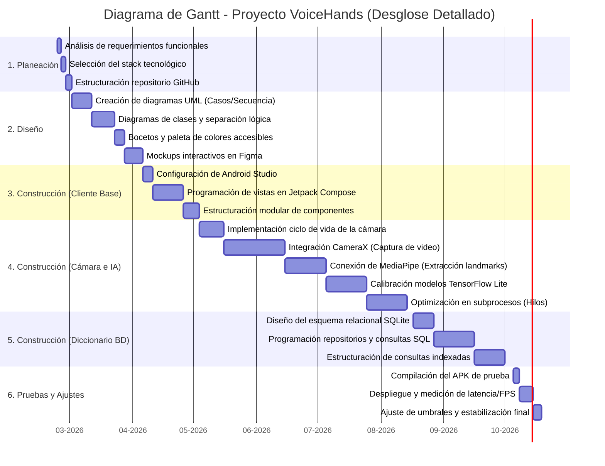

## Metodología y Cronograma

```mermaid
gantt
    title Diagrama de Gantt - Proyecto VoiceHands (Desglose Detallado)
    dateFormat  YYYY-MM-DD
    axisFormat  %m-%Y
    
    section 1. Planeación
    Análisis de requerimientos funcionales      :a1, 2026-02-23, 2d
    Selección del stack tecnológico             :a2, after a1, 2d
    Estructuración repositorio GitHub           :a3, after a2, 3d
    
    section 2. Diseño
    Creación de diagramas UML (Casos/Secuencia) :a4, 2026-03-02, 10d
    Diagramas de clases y separación lógica     :a5, after a4, 11d
    Bocetos y paleta de colores accesibles      :a6, 2026-03-23, 5d
    Mockups interactivos en Figma               :a7, after a6, 9d
    
    section 3. Construcción (Cliente Base)
    Configuración de Android Studio             :a8, 2026-04-06, 5d
    Programación de vistas en Jetpack Compose   :a9, after a8, 15d
    Estructuración modular de componentes       :a10, after a9, 8d
    
    section 4. Construcción (Cámara e IA)
    Implementación ciclo de vida de la cámara   :a11, 2026-05-04, 12d
    Integración CameraX (Captura de video)      :a12, after a11, 30d
    Conexión de MediaPipe (Extracción landmarks):a13, 2026-06-15, 20d
    Calibración modelos TensorFlow Lite         :a14, after a13, 20d
    Optimización en subprocesos (Hilos)         :a15, after a14, 20d
    
    section 5. Construcción (Diccionario BD)
    Diseño del esquema relacional SQLite        :a16, 2026-08-17, 10d
    Programación repositorios y consultas SQL   :a17, after a16, 20d
    Estructuración de consultas indexadas       :a18, after a17, 15d
    
    section 6. Pruebas y Ajustes
    Compilación del APK de prueba               :a19, 2026-10-05, 3d
    Despliegue y medición de latencia/FPS       :a20, after a19, 7d
    Ajuste de umbrales y estabilización final   :a21, after a20, 4d
```
