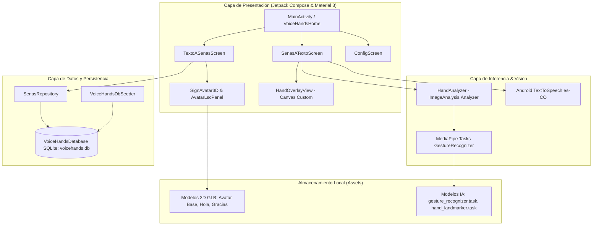
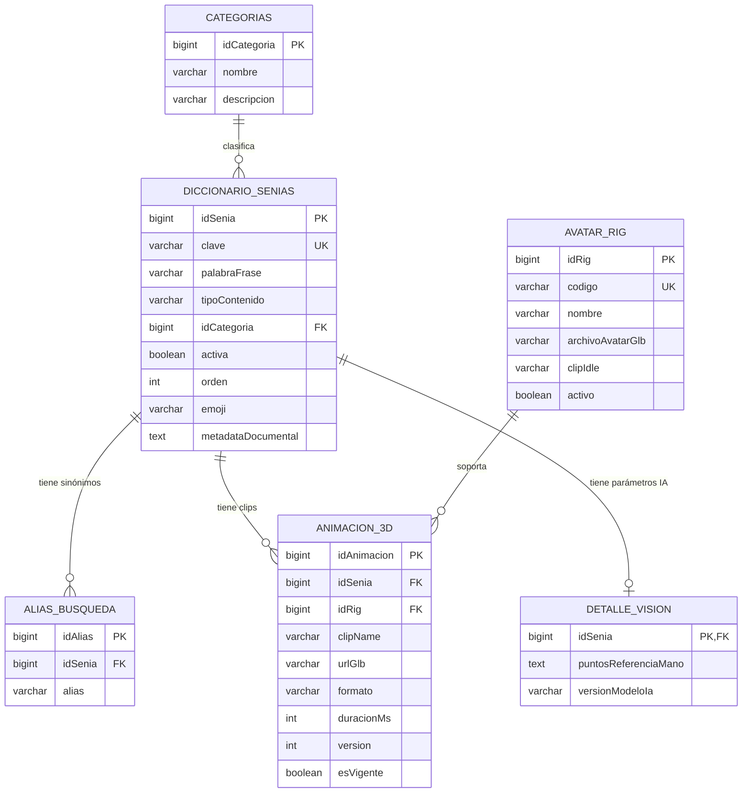

# VoiceHands — Contexto Técnico Completo del Sistema
**Versión de la Aplicación:** 0.1.0 (versionCode: 1)  
**ID de Aplicación / Package:** `com.voicehands.app`  
**Plataforma:** Android Nativo (Kotlin 2.3.20, JVM 17)  
**Fecha de Generación:** Octubre 2026  

---

## 1. Resumen Ejecutivo y Propósito
**VoiceHands** es una solución móvil inclusiva desarrollada para facilitar la comunicación bidireccional y accesible entre personas con discapacidad auditiva y personas oyentes. Su objetivo central es la traducción en tiempo real entre la **Lengua de Señas Colombiana (LSC-CO)** y **texto/voz**, ejecutando todo el procesamiento de inteligencia artificial y renderizado 3D de forma local (*on-device*), garantizando privacidad, inmediatez y funcionamiento sin dependencia de conexión a internet.

---

## 2. Ficha Técnica y Especificaciones del Entorno

| Parámetro | Valor / Especificación |
| :--- | :--- |
| **Lenguaje de Programación** | Kotlin 2.3.20 |
| **Java Virtual Machine (JVM)** | Target 17 |
| **Android Gradle Plugin (AGP)** | 9.3.2 |
| **Gradle Wrapper** | 9.5.0 |
| **Kotlin Symbol Processing (KSP)** | 2.3.10 |
| **Min SDK** | 24 (Android 7.0 Nougat) |
| **Compile SDK / Target SDK** | 36 (Android 16 preview / moderno) |
| **Arquitecturas NDK (ABI Filters)** | `armeabi-v7a`, `arm64-v8a`, `x86`, `x86_64` |
| **UI Framework** | Jetpack Compose (BOM 2026.02.01) + Material 3 |
| **Motor de Render 3D** | SceneView 4.1.1 (Google Filament Engine) |
| **Visión Artificial e IA** | Google MediaPipe Tasks Vision 0.10.14 |
| **Control de Cámara** | AndroidX CameraX 1.3.2 |
| **Base de Datos Local** | AndroidX Room 2.7.1 (SQLite) |
| **Síntesis de Voz (TTS)** | `android.speech.tts.TextToSpeech` (Locale: `"es"`, `"CO"`) |

---

## 3. Arquitectura del Software

El sistema sigue una arquitectura basada en **Clean Architecture** estructurada con **MVVM (Model-View-ViewModel)** y **UDF (Unidirectional Data Flow)**:



---

## 4. Estructura de Directorios del Código Fuente

```text
VoiceHandsV.0.1/
├── app/
│   ├── build.gradle.kts                 # Configuración de dependencias, Compose, KSP y NDK
│   └── src/main/
│       ├── AndroidManifest.xml          # Permisos de hardware y definición de actividades
│       ├── assets/
│       │   ├── gesture_recognizer.task  # Modelo MediaPipe para clasificación y landmarks
│       │   ├── hand_landmarker.task     # Modelo complementario para landmarks de manos
│       │   └── models/
│       │       ├── Avatar_Masculino_Base.glb  # Avatar 3D principal en reposo (idle)
│       │       ├── avatar_rigged.glb          # Modelo secundario rigged
│       │       ├── hola_default.glb           # Clip animado para la seña "Hola"
│       │       └── Gracias_default.glb        # Clip animado para la seña "Gracias"
│       ├── java/com/voicehands/app/
│       │   ├── VoiceHandsApp.kt         # Clase Application: inicialización de BD y Seeder
│       │   ├── MainActivity.kt          # Entrada principal, splash y control de tema
│       │   ├── analyzer/
│       │   │   └── HandAnalyzer.kt      # Analizador de frames CameraX + inferencia MediaPipe
│       │   ├── data/
│       │   │   ├── db/
│       │   │   │   ├── VoiceHandsDatabase.kt   # Definición Room Database v1
│       │   │   │   ├── VoiceHandsDbSeeder.kt   # Poblado de datos iniciales
│       │   │   │   ├── dao/
│       │   │   │   │   ├── AliasBusquedaDao.kt
│       │   │   │   │   ├── Animacion3dDao.kt
│       │   │   │   │   ├── AvatarRigDao.kt
│       │   │   │   │   ├── CategoriaDao.kt
│       │   │   │   │   ├── DetalleVisionDao.kt
│       │   │   │   │   └── DiccionarioSeniaDao.kt
│       │   │   │   └── entity/
│       │   │   │       ├── AliasBusquedaEntity.kt
│       │   │   │       ├── Animacion3dEntity.kt
│       │   │   │       ├── AvatarRigEntity.kt
│       │   │   │       ├── CategoriaEntity.kt
│       │   │   │       ├── DetalleVisionEntity.kt
│       │   │   │       └── DiccionarioSeniaEntity.kt
│       │   │   └── repository/
│       │   │       └── SenasRepository.kt      # Repositorio unificado con Flows reactivos
│       │   ├── lsc/
│       │   │   ├── AvatarAssets.kt      # Constantes de rutas de archivos 3D
│       │   │   └── LscAvatarParams.kt   # Calibración de cámara, escala y glosas LSC
│       │   └── ui/
│       │       ├── components/
│       │       │   ├── AvatarLsc.kt     # Panel 3D y enumeración AvatarMotion
│       │       │   ├── HandOverlayView.kt # Dibujado de esqueleto anatómico sobre Canvas
│       │       │   └── SignAvatar3D.kt  # Integración SceneView/Filament con skybox opaco
│       │       ├── screens/
│       │       │   ├── ConfigScreen.kt  # Gestión de permisos y modo oscuro
│       │       │   ├── SenasATexto.kt   # Módulo de visión, captura y síntesis de voz
│       │       │   └── TextoASenas.kt   # Módulo de traducción a señas con avatar 3D
│       │       └── theme/
│       │           ├── Color.kt         # Paleta accesible (CelestePrimary #4FC3F7)
│       │           ├── Theme.kt         # VoiceHandsTheme (Material 3 claro y oscuro)
│       │           └── Type.kt          # Definición tipográfica
```

---

## 5. Modelo de Datos y Persistencia (Room Database)

La base de datos `voicehands.db` implementa un modelo relacional de 6 entidades:



### Detalle de Entidades:
1. **`CategoriaEntity` (`categorias`):** Permite organizar las señas por áreas temáticas (ej. "Comunes").
2. **`DiccionarioSeniaEntity` (`diccionario_senias`):** Catálogo maestro de señas. Almacena la palabra visible, emoji, clave única (ej. `"hola"`), orden para la rejilla visual y metadatos JSON documentales (glosa de referencia).
3. **`AliasBusquedaEntity` (`alias_busqueda`):** Permite que el buscador de texto responda a sinónimos y variaciones léxicas con eliminación en cascada (`CASCADE`).
4. **`AvatarRigEntity` (`avatar_rig`):** Registra el rig del avatar esquelético (`avatar_v1`) y el archivo 3D de reposo (`idle`).
5. **`Animacion3dEntity` (`animacion_3d`):** Vincula cada seña a un rig específico, la ruta del archivo `.glb` (en assets o almacenamiento), la duración en milisegundos y el control de versiones.
6. **`DetalleVisionEntity` (`detalle_vision`):** Diseñada para almacenar descriptores biométricos o landmarks esperados para futuras versiones del clasificador de visión.
7. **`VoiceHandsDbSeeder`:** Sembrador de arranque que precarga 10 señas base en el primer inicio: *Hola, Gracias, Ayuda, Soy Sordo, Agua, Comida, Baño, Sí, No, Por favor*.

---

## 6. Especificación de Componentes y Módulos

### A. Core y Navegación (`MainActivity.kt`)
* **Arranque y Bienvenida (`AppIniPantalla`):** Pantalla minimalista con el isotipo de la aplicación que realiza una transición animada fluida con `AnimatedContent` (fade y desplazamiento vertical sincronizado).
* **Gestión de Tema:** Alternancia dinámica de modo claro y oscuro guardada con `rememberSaveable`, garantizando contraste accesible WCAG sobre el color corporativo Celeste (`#4FC3F7`).
* **Contenedor Scaffold (`VoiceHandsHome`):** Barra superior dinámica con buscador integrado y barra de navegación inferior de 3 accesos: *Texto a Señas*, *Señas a Texto* y *Configuración*.

### B. Módulo Texto a Señas (`TextoASenas.kt` y `SignAvatar3D.kt`)
* **Pestaña "Palabras":** 
  * Rejilla interactiva en dos columnas con tarjetas que presentan emoji y palabra.
  * Buscador reactivo conectado a Room mediante consultas SQL con operador `LIKE` sobre palabra, clave y tabla de alias.
  * Desplazamiento táctil optimizado mediante `rememberFlingSuavePastillas` con decaimiento exponencial (`frictionMultiplier = 0.42f`).
* **Pestaña "Oraciones":**
  * Campo multilínea para redactar oraciones completas.
  * **Tokenizador:** Normaliza el texto, elimina puntuación y detecta locuciones compuestas como `"por favor"`.
  * **Secuenciador:** Reproduce las animaciones en el avatar 3D de forma encadenada con pausas de 1350 ms por cada seña encontrada.
* **Motor de Render 3D (`SignAvatar3D.kt`):**
  * Basado en SceneView 4.1.1 (Google Filament).
  * **Encuadre en Plano Americano (`EncuadreAvatarFijo`):** Posiciona la cámara fija de frente (`camY = 0.40f`, `camZ = 1.18f`, `scaleToUnits = 1.72f`) encuadrando al personaje desde la cintura para máxima claridad de manos y rostro.
  * **Skybox Opaco Dinámico:** Utiliza un fondo de iluminación opaco sincronizado con el tema (`colorHojaAvatar()`), evitando la pantalla negra típica de las transparencias con Filament.
  * **Preservación Gráfica:** Utiliza `movableContentOf` para mover la instancia del render entre cambios de orientación (vertical/horizontal) y pestañas sin reiniciar el contexto gráfico.

### C. Módulo Señas a Texto (`SenasATexto.kt` y `HandAnalyzer.kt`)
* **Control de Cámara:** Integración con CameraX permitiendo alternar entre cámara frontal y trasera en tiempo real con `LifecycleCameraController`.
* **Procesamiento de Cuadros en Tiempo Real (`HandAnalyzer.kt`):**
  * Extrae fotogramas mediante `ImageAnalysis.Analyzer` en modo `LIVE_STREAM`.
  * Aplica rotación según la matriz del sensor del dispositivo y envía el `Bitmap` normalizado a MediaPipe `GestureRecognizer`.
  * Umbrales de confianza calibrados a `0.18f` para garantizar detección continua y fluida de hasta dos manos simultáneas.
* **Superposición Gráfica en Canvas (`HandOverlayView.kt`):**
  * Componente nativo acelerado por hardware que dibuja los 21 puntos anatómicos (verde) y las 21 conexiones óseas (cian).
  * Refleja horizontalmente las coordenadas (`1 - x`) cuando se usa la cámara frontal para mantener la experiencia de espejo.
* **Acumulador Inteligente y Debounce:**
  * Requiere **300 ms continuos** de estabilidad en la letra o número detectado para añadirlo a la frase acumulada.
  * Inserta un **espacio automático** tras 2000 ms de reposo o inactividad.
* **Síntesis de Voz (TTS):**
  * Opción de lectura vocal en tiempo real letra por letra mediante un switch.
  * Botón de lectura completa de la frase armada mediante `TextToSpeech` nativo configurado en `Locale("es", "CO")`.

### D. Módulo de Configuración y Seguridad (`ConfigScreen.kt`)
* **Permisos del Sistema:** Verifica y solicita `Manifest.permission.CAMERA` mediante `rememberLauncherForActivityResult`. Si el permiso es revocado permanentemente, ofrece un enlace directo a los ajustes del sistema del dispositivo (`Settings.ACTION_APPLICATION_DETAILS_SETTINGS`).
* **Preferencias:** Permite conmutar el modo oscuro y consultar la versión del software.

---

## 7. Privacidad y Seguridad de Datos
* **Procesamiento 100% On-Device:** Las imágenes de la cámara se procesan en la memoria RAM del dispositivo a través de MediaPipe y nunca se transmiten por red ni se almacenan en disco.
* **Cumplimiento de Privacidad:** No requiere cuentas de usuario ni recopila información biométrica personal.

---

## 8. Prompt Maestro para Generación del Manual Técnico Formal

Copia y pega el siguiente bloque en otra IA para que te redacte el manual técnico completo y formateado:

```text
Actúa como un Ingeniero de Software Principal y Arquitecto Móvil Senior especializado en Android y Accesibilidad. A partir de la información técnica del proyecto VoiceHands v0.1.0 provista a continuación, redacta un MANUAL TÉCNICO EXHAUSTIVO, RIGUROSO Y COMPLETO en formato Markdown con estándares IEEE/ISO, listo para ser entregado a un comité técnico de evaluación o equipo de desarrollo.

DATOS DEL PROYECTO:
- Nombre: VoiceHands v0.1.0 (com.voicehands.app)
- Stack: Kotlin 2.3.20 (JVM 17), AGP 9.3.2, Gradle 9.5.0, KSP 2.3.10, Min SDK 24, Target SDK 36.
- UI: Jetpack Compose (BOM 2026.02.01), Material 3, Navigation Compose 2.7.7.
- Render 3D: SceneView 4.1.1 (Google Filament Engine), modelos GLB en assets, encuadre en plano americano (EncuadreAvatarFijo) y skybox opaco reactivo al tema con movableContentOf.
- Visión Artificial: CameraX 1.3.2 + Google MediaPipe Tasks Vision 0.10.14 (gesture_recognizer.task), 21 landmarks por mano, HandAnalyzer con ImageAnalysis en streaming y HandOverlayView con Canvas custom.
- Debounce y Texto: Confirmación a los 300ms de gesto estable, espacio a los 2000ms sin manos, síntesis de voz con Android TextToSpeech en Locale("es", "CO").
- Persistencia: SQLite con Android Room 2.7.1 (voicehands.db), 6 entidades (CategoriaEntity, DiccionarioSeniaEntity, AliasBusquedaEntity, AvatarRigEntity, Animacion3dEntity, DetalleVisionEntity) y Seeder automático de 10 señas base.
- Seguridad: Procesamiento biométrico estrictamente local (on-device) sin conexión externa.

ESTRUCTURA DEL MANUAL REQUERIDA:
1. PORTADA, INFORMACIÓN GENERAL Y CONTROL DE VERSIONES
2. INTRODUCCIÓN, OBJETIVOS Y ALCANCE DEL PROYECTO
3. REQUISITOS DEL SISTEMA (HARDWARE Y SOFTWARE MÍNIMO/RECOMENDADO)
4. ARQUITECTURA DE SOFTWARE Y PATRONES DE DISEÑO (incluir diagrama Mermaid)
5. MODELO DE DATOS Y ESPECIFICACIÓN DE PERSISTENCIA ROOM (incluir diagrama ER Mermaid y diccionario detallado de tablas)
6. ARQUITECTURA DE COMPONENTES Y FLUJO DE DATOS:
   6.1. Ciclo de Vida y Navegación Principal
   6.2. Módulo Texto a Señas (Filament, SceneView, Tokenizador y Sincronización)
   6.3. Módulo Señas a Texto (CameraX, Pipeline MediaPipe, HandOverlayView, Algoritmo de Debounce y TTS)
   6.4. Módulo de Configuración y Seguridad de Permisos
7. GUÍA DE INSTALACIÓN, COMPILACIÓN Y DESPLIEGUE (Gradle, NDK, variables de entorno ANDROID_HOME)
8. SEGURIDAD, PRIVACIDAD Y PROCESAMIENTO ON-DEVICE
9. GUÍA DE MANTENIMIENTO: CÓMO AÑADIR NUEVAS SEÑAS Y MODELOS 3D AL DICCIONARIO
10. CONCLUSIONES Y HOJA DE RUTA FUTURA
```
